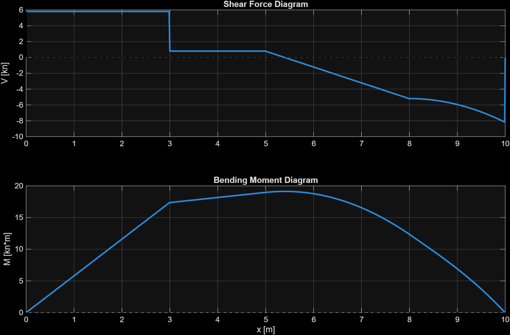
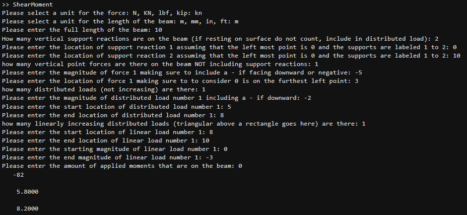

# Shear Force and Bending Moment Diagram Generator

A MATLAB-based beam analysis tool that calculates support reactions and generates shear force and bending moment diagrams for statically determinate beams.

The program uses an interactive command-line interface that allows the user to define the beam geometry, supports, applied loads, and moments. It then evaluates the loading conditions and automatically generates shear force and bending moment diagrams.

## Example Output

The following example demonstrates the program analyzing a beam with a point load, uniform distributed load, and linearly varying distributed load.



[View the full example case](example_case.md)

## Features

* Interactive MATLAB command-line input
* User-selectable force and length units
* Support for up to two vertical support reactions
* Point loads
* Uniform distributed loads
* Linearly varying distributed loads
* Applied moments
* Automatic calculation of support reactions
* Automatic generation of shear force diagrams
* Automatic generation of bending moment diagrams
* Input validation for beam geometry and loading conditions
* Event-based numerical grid for improved diagram resolution near load and support locations

## Supported Units

### Force

* N
* kN
* lbf
* kip

### Length

* m
* mm
* in
* ft

The program maintains the units selected by the user throughout the analysis.

## Load Types

The calculator supports several common beam-loading conditions.

### Point Loads

The user specifies:

* Load magnitude
* Load direction
* Position along the beam

Downward forces are entered as negative values.

### Uniform Distributed Loads

The user specifies:

* Load intensity
* Start location
* End location

The distributed load is converted to an equivalent resultant when solving for the beam reactions.

### Linearly Varying Distributed Loads

The program supports triangular and trapezoidal distributed loads.

The user specifies:

* Starting location
* Ending location
* Starting load intensity
* Ending load intensity

The load is decomposed into equivalent rectangular and triangular components when calculating support reactions.

### Applied Moments

The user specifies:

* Moment magnitude
* Location along the beam

Applied moments are incorporated into both the equilibrium calculations and bending moment diagram.

## Support Reactions

The program supports zero, one, or two vertical reaction forces.

For beams with two supports, the reactions are calculated using static equilibrium:

* Sum of vertical forces
* Sum of moments about one support

The program limits the number of vertical reactions to two in order to remain within the intended statically determinate beam-analysis scope.

## Shear and Moment Diagram Generation

After solving the reaction forces, the program builds a numerical position grid along the beam.

Important locations such as:

* Support positions
* Point load positions
* Distributed load boundaries
* Linear load boundaries
* Applied moment locations

are included directly in the grid.

Additional points are generated between these locations to create smooth curves.

The distributed loading function is evaluated along the beam and numerically integrated to obtain the shear force and bending moment distributions.

The program then produces two plots:

1. **Shear Force Diagram**
2. **Bending Moment Diagram**

## Running the Program

1. Download `ShearMoment.m`.
2. Open MATLAB.
3. Navigate to the directory containing the file.
4. Run:

```matlab
ShearMoment
```

5. Follow the prompts in the MATLAB Command Window to define the beam and loading conditions.
6. After the inputs are complete, the calculated reaction forces and shear/moment diagrams will be displayed.

## Example Workflow

A typical analysis consists of entering:

```text
Force units
Length units
Beam length
Number and location of supports
Number, magnitude, and location of point loads
Number and range of distributed loads
Number and range of linearly varying loads
Number, magnitude, and location of applied moments
```

The program then calculates the support reactions and automatically generates the corresponding diagrams.

## Command Window Example

The program uses an interactive MATLAB command-line interface to define the beam geometry, supports, and applied loading. The calculated support reactions are displayed after the inputs are entered.



## Numerical Method

Distributed loads are represented as load-intensity functions along the beam.

The program evaluates these loads over an event-aware numerical grid and uses numerical integration to construct the diagrams:

```text
Distributed Load → Shear Force → Bending Moment
```

Support reactions and point loads are represented as discrete jumps in the shear diagram, while applied moments create discrete changes in the bending moment diagram.

## Current Scope

This project is intended for statically determinate beam problems using vertical loading.

Current assumptions and limitations include:

* Maximum of two vertical support reactions
* Beam loading is analyzed in a two-dimensional vertical plane
* Axial forces are not considered
* Beam deflection and stress calculations are not currently included
* Load locations must fall within the defined beam length
* Linearly varying loads must maintain a consistent loading direction

## File Structure

```text
Shear-Moment-Diagram-Generator/
│
├── ShearMoment.m
├── README.md
├── example_case.md
├── example_output.png
└── window_output.png
```

## Technologies

* MATLAB
* Numerical integration
* Engineering statics
* Beam analysis
* Data visualization

## Purpose

This project was developed to automate repetitive beam statics calculations while providing an immediate visual representation of the resulting internal shear forces and bending moments.

It combines static-equilibrium calculations, numerical methods, user-input validation, and MATLAB visualization into a single interactive engineering analysis tool.
